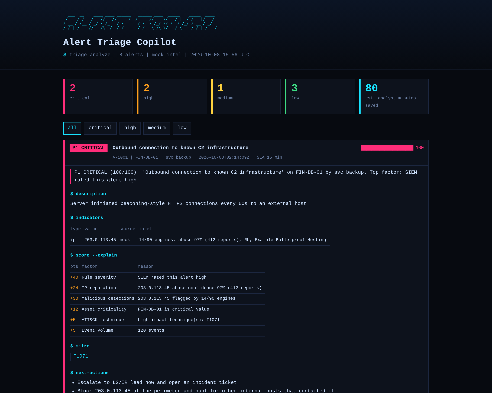
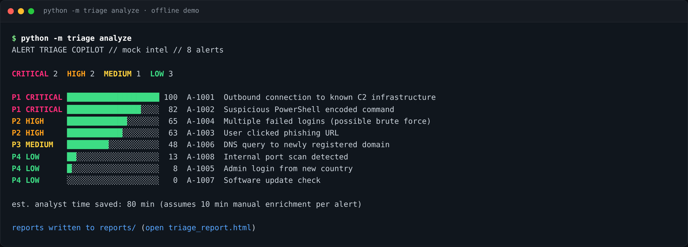
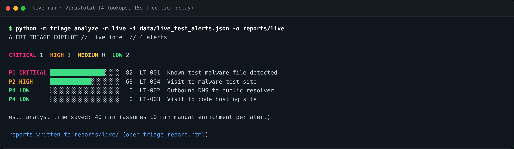
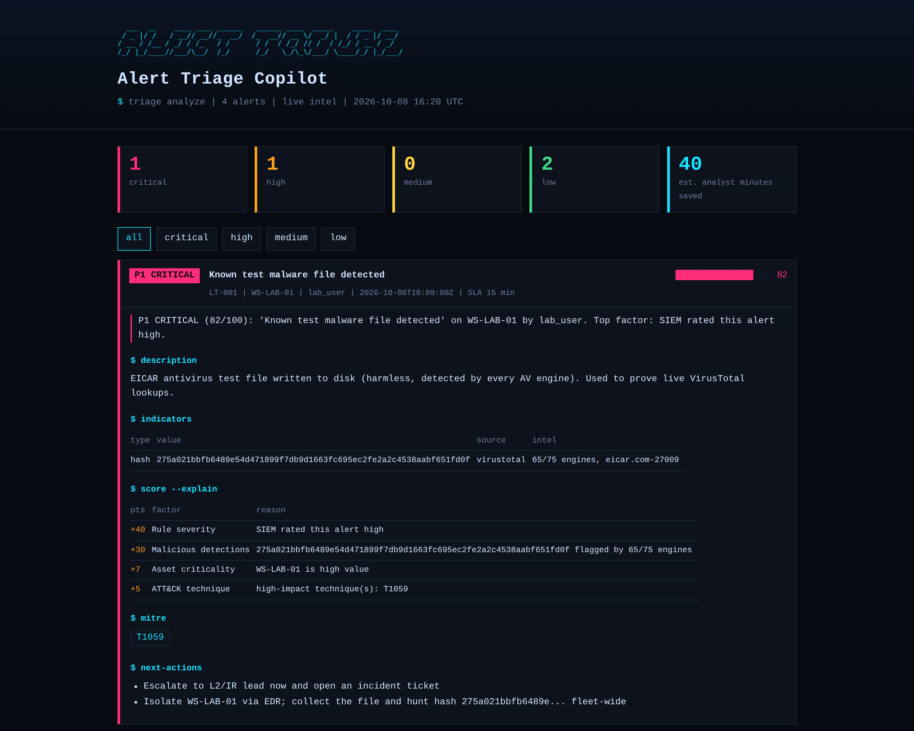
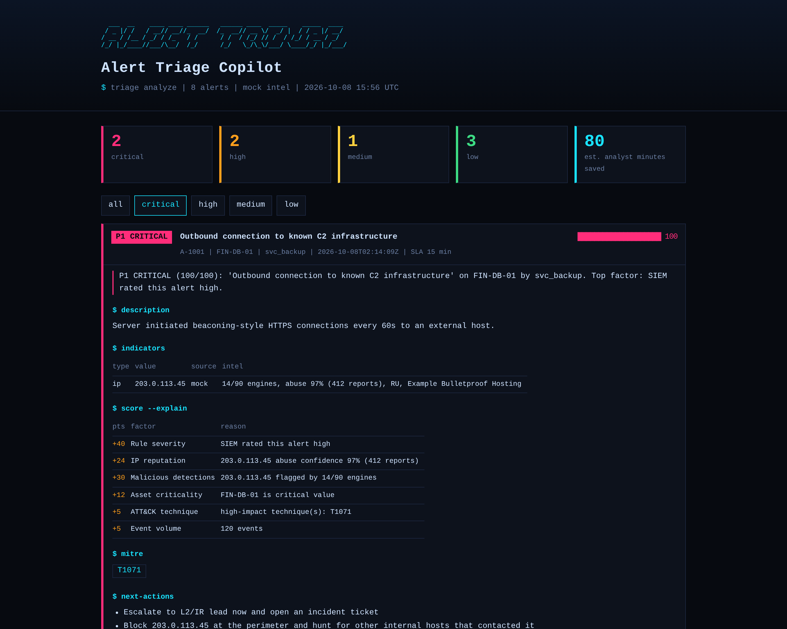
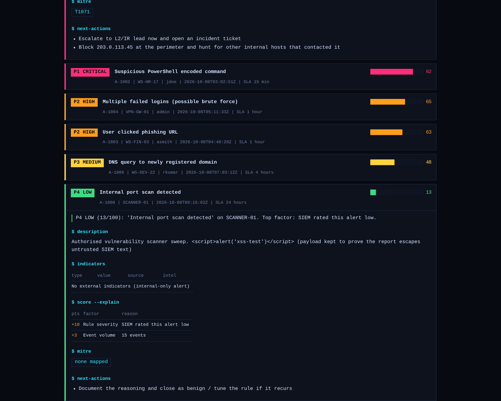
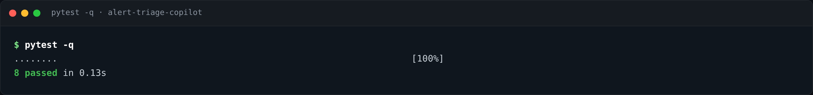

# Alert Triage Copilot

> Turn a pile of raw SIEM alerts into a ranked, explained, ready-to-act triage queue in seconds.




## Why this exists

An L1 SOC analyst's shift is dominated by one loop: open an alert, copy the IP, domain or file hash into
VirusTotal and AbuseIPDB, check the host and the user, decide a severity, write the ticket note. Then repeat, hundreds
of times. It is slow and repetitive, and it is a major driver of **alert fatigue**, which is how real attacks get
missed in a pile of noise.

Alert Triage Copilot automates the lookup-and-prioritise part of that loop. It does not replace the analyst's
judgement. It gives the analyst a ranked queue where **every score is explained**, so the decision is faster and
can still be defended.

## What it does

| Step | What happens |
|---|---|
| **Ingest** | Reads `.json`, `.jsonl` or `.csv` SIEM exports. Field names are normalised (`src_ip` / `source.ip` / `src`, numeric or text severity, and so on). |
| **Extract** | Pulls IPs, domains and file hashes from fields and from free-text descriptions. Internal IPs are kept local and never sent to a third party. |
| **Enrich** | Looks each indicator up in VirusTotal and AbuseIPDB (or uses an offline demo mode). Each unique indicator is queried once, however many alerts share it. |
| **Score** | Builds a 0-100 score from rule severity, IP reputation, malicious detections, asset criticality, MITRE ATT&CK technique, event volume, and a discount when every indicator is clean. |
| **Explain** | Lists every point with its reason. No black box. |
| **Report** | Colour terminal queue, an interactive HTML dashboard, Markdown (paste into a ticket) and JSON (feed a SOAR). |

## How it runs

```
 SIEM export            +-----------+     +-----------+     +-----------+     +-----------+
 (json/jsonl/csv) ----> | parsers   | --> | enrichment| --> | scoring   | --> | report    |
                        | normalise |     | VT+Abuse  |     | explain   |     | html/md/  |
                        | extract   |     | or mock   |     | + actions |     | json/term |
                        | IOCs      |     | (cached)  |     |           |     |           |
                        +-----------+     +-----------+     +-----------+     +-----------+
```

There are two modes:

- **mock** (default): offline, no keys, uses built-in synthetic intelligence. Good for trying it out and for tests.
- **live**: queries the real VirusTotal API (and AbuseIPDB if you provide a key).

## Quickstart (offline, no API keys)

```bash
git clone https://github.com/NChiranjeevi6/alert-triage-copilot.git
cd alert-triage-copilot
python -m venv .venv
source .venv/bin/activate          # Windows: .venv\Scripts\activate
pip install -r requirements.txt
python -m triage analyze           # offline demo on data/sample_alerts.json
```

Then open `reports/triage_report.html` in a browser.



## Live mode (real VirusTotal lookups)

1. Create a free account at [virustotal.com](https://www.virustotal.com) and copy your API key from your profile.
2. Put the key in an **environment variable**. The tool does not read a `.env` file by itself.
   - Mac/Linux: `export VT_API_KEY=your_key`
   - PowerShell: `$env:VT_API_KEY="your_key"`
3. Run it:

```bash
python -m triage analyze --mode live --input data/live_test_alerts.json --out reports/live
```

`data/live_test_alerts.json` contains four safe indicators on purpose: the EICAR antivirus test file hash, Google's
public DNS `8.8.8.8`, `github.com`, and the `malware.wicar.org` test site.

Useful options:

| Option | Meaning |
|---|---|
| `--min-score 35` | Hide alerts below a score, to cut noise |
| `--vt-delay 15` | Seconds between VirusTotal calls. 15 respects the free tier (4 requests per minute) |
| `--manual-minutes 10` | Assumed manual minutes per alert, behind the "time saved" figure |
| `--out DIR` | Where to write the HTML, Markdown and JSON reports |

## Proof it works

### Live run against VirusTotal



| Alert | Indicator | VirusTotal result | Score |
|---|---|---|---|
| LT-001 | EICAR test file hash | 65 / 75 engines flag it | **82 CRITICAL (P1)** |
| LT-002 | `8.8.8.8` (Google DNS) | 0 / 92 | 0 LOW (P4) |
| LT-003 | `github.com` | 0 / 92 | 0 LOW (P4) |
| LT-004 | `malware.wicar.org` | 18 / 92 (data at the time of the run) | 63 HIGH (P2) |

The known-bad file is escalated, the two known-good indicators stay at zero, and the test site lands in between.
Detection counts come from live data and will drift over time. The full live report is in
[`docs/live_report.html`](docs/live_report.html).



### Offline demo: the queue

The bundled sample has 8 alerts. The copilot ranks the C2 beacon from a critical database server and the
malicious-hash PowerShell alert as P1, the brute-force and phishing click as P2, and sinks a routine update check and
an authorised internal scan to P4.



### Untrusted alert text cannot inject script into the report

SIEM data is untrusted. Alert A-1008 deliberately contains a `<script>` payload. The report shows it as plain text
and never executes it.



### Tests



## Scoring model

| Factor | Points | Trigger |
|---|---|---|
| Rule severity | 10 / 25 / 40 / 55 | low / medium / high / critical |
| IP reputation | up to +25 | AbuseIPDB confidence x 0.25 |
| Malicious detections | up to +30 | 10+ engines flagging any indicator = full points |
| Asset criticality | 0 / 3 / 7 / 12 | low / medium / high / critical asset |
| ATT&CK technique | +5 | High-impact technique (T1059, T1071, T1566, T1110, ...) |
| Event volume | +3 / +5 | 10+ / 50+ events |
| All indicators clean | -10 | Low or medium alert where every enriched indicator is clean |

| Score | Verdict | Priority | Target response |
|---|---|---|---|
| 80-100 | CRITICAL | P1 | 15 min |
| 60-79 | HIGH | P2 | 1 hour |
| 35-59 | MEDIUM | P3 | 4 hours |
| 0-34 | LOW | P4 | 24 hours |

The weights live in `triage/scoring.py` and are meant to be tuned to your environment. This is a transparent
heuristic, not a trained model.

## MITRE ATT&CK coverage

Alerts carrying these techniques get a score boost and technique-specific response advice:
`T1059` Command and Scripting Interpreter, `T1071` Application Layer Protocol (C2), `T1566` Phishing,
`T1110` Brute Force, `T1078` Valid Accounts, `T1003` Credential Dumping, `T1486` Data Encrypted for Impact,
`T1041` Exfiltration Over C2, `T1105` Ingress Tool Transfer, `T1021` Remote Services.

## Tests

```bash
pytest -q     # 8 tests
```

They cover IOC extraction, field-alias handling, scoring, escalation of known-bad scenarios, benign alerts staying
low, the score always equalling the sum of its breakdown, and XSS-safe reports. CI runs them on Python 3.10 and 3.12
on every push.

## Security and responsible use

- Internal IPs (RFC 1918, loopback, link-local) are never sent to third parties.
- API keys come from environment variables only. `.env` is git-ignored.
- Untrusted SIEM text is HTML-escaped in reports.
- Lookup failures never crash a run. They are shown as `lookup failed`.
- Demo data is synthetic: RFC 5737 documentation IPs, reserved `.example` domains and the harmless EICAR test hash.

Check your organisation's policy before sending indicators to third-party services, and note that VirusTotal's free
API is for non-commercial use. See [SECURITY.md](SECURITY.md).

## Known limitations

- The VirusTotal live path has been tested end to end. The AbuseIPDB path is implemented but has not yet been
  verified against the live API.
- VirusTotal's free tier allows 4 requests per minute, so large alert files are slow in live mode.
- Scores are a rule-based heuristic and need tuning for each environment.

## Roadmap

- [ ] Splunk, Elastic and Wazuh connectors that pull alerts directly
- [ ] URLhaus, OTX and GreyNoise as extra intelligence sources
- [ ] Analyst feedback loop that tunes weights from closed tickets
- [ ] SOAR and webhook output (Slack, TheHive, Jira)

## Skills demonstrated

SOC alert triage workflow, threat-intelligence enrichment (VirusTotal, AbuseIPDB), IOC extraction, MITRE ATT&CK
mapping, incident prioritisation with SLAs, secure coding (input escaping, secrets handling, data minimisation),
Python packaging, unit testing, CI with GitHub Actions.

## License

MIT. See [LICENSE](LICENSE).
